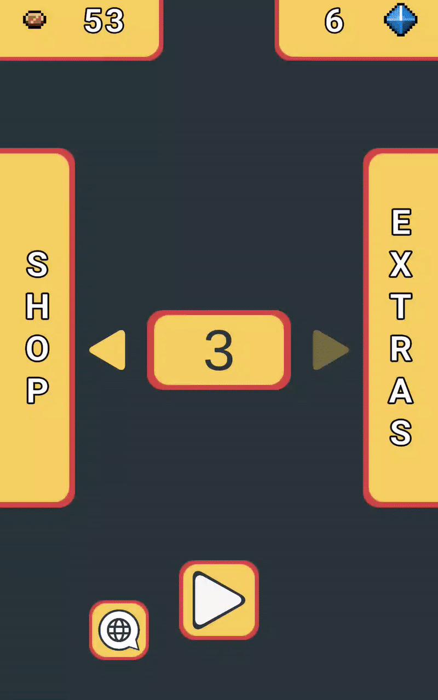

# Project-D
 This **arcade-adventure** game is not a project of my original creation. It is a rip-off of [**Tomb of the Mask**](https://play.google.com/store/apps/details?id=com.playgendary.tom&pli=1) developed by [**Playgendary Limited**](https://playgendary.com/en). Nonetheless, I have included some twists in my game to differ from the original 

## Implementation summary

### Movement

||
|----------------------------------|

### Enemies and Hazards
| Shooting Trap and Ghost                     | Bat                       |
|:-------------------------------------------:|:-------------------------:|
| | |

### Other Mechanics, Rules and Implementation
The game currently implements the followign mechancis and rules.

#### Localization System: available in Spanish and English

#### Different level difficulties: the different levels can take up to 3 different difficulties
- **Easy** 
  - 1 extra life
  - 10 extra seconds
  - Spike trap takes longer to activate
  - Shooting trap 
- **Normal**
  - No extra lives.
  - No extra time.
- **Hard** 
  - -1 extra life (limited at a minimun of 1)
  - -10 extra seconds

#### Currencies:

There are two types of currencies: coins and gems. Coins are used to buy upgrades and can be obtained inside levels with no limit (every time a level is played, the same amount of
coins will appear). Gems are obtained inside levels too. However, these gems can only be picked up once per level, they will not appear on further replays of the levels once they have been collected and they are used to unlock extra content inside the game.

 #### Upgrades: extra time and lives upgrades can be bought to make levels easier to beat

 
 
